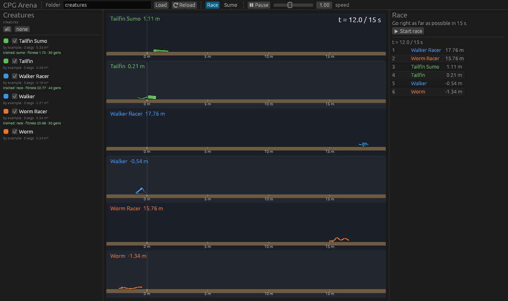
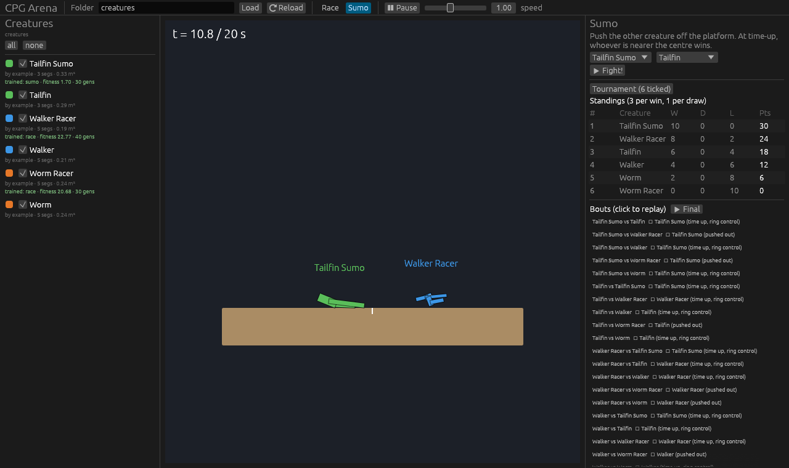

# CPG Arena: 自己写遗传算法，进化人造生物

一个轻量级的教学游戏。每个学生设计一只由方块和关节组成的 2D 生物，关节由 **CPG（中枢模式发生器）** 驱动。学生**自己写遗传算法**进化它的参数，然后把生物文件放进同一个文件夹里比赛：**赛跑**比谁跑得远，**相扑**比谁把对手推下台。

| 赛跑（每只生物一条赛道） | 相扑（循环赛 + 决赛回放） |
|---|---|
|  |  |

源自本仓库的 MATLAB/Simulink 项目（Snake5 / chain_CPG），CPG 模型相同（Sproewitz et al. 2008），但修正了原 MATLAB 代码里的两个问题（见 [cpg.rs](src/cpg.rs) 顶部注释）。

---

## 快速开始

```bash
cd arena
cargo build --release                        # 需要 Rust ≥ 1.92
./target/release/arena-gui creatures         # 打开界面
python3 python/my_ga.py                      # 跑一遍 GA 骨架
```

Linux 如果报 `libxkbcommon-x11.so could not be loaded`：`sudo apt install libxkbcommon-x11-0`。
只要命令行工具（比如在服务器上）：`cargo build --release --no-default-features`。

---

## 学生要做什么

```text
1. 设计身体             2. 写 GA 进化参数                  3. 提交                 4. 比赛
worm.toml  ─────────▶  python/my_ga.py  ──────────────▶  me.toml 拷进班级文件夹 ──▶ arena-gui 班级文件夹
（手写拓扑）           （选择 / 交叉 / 变异由你实现）                             （自动刷新）
```

### 1. 设计身体：生物文件

一个 `.toml` 文件就是一只生物。`segment` 0 是躯干，其余每一节通过一个电机关节挂在前面的某一节上，每个关节由一个 CPG 振荡器驱动。

```toml
name = "Worm"
author = "张三"
color = [230, 120, 40]      # 可选

[brain]
frequency = 1.0             # 振荡频率 (Hz)，所有关节共用
coupling = 4.0              # 相邻振荡器同步的强度

[[segment]]                 # 0: 躯干，没有关节
length = 0.4                # 米
width = 0.12

[[segment]]
parent = 0                  # 挂在哪一节上（必须是前面的节）
attach = 1.0                # 挂在父节的哪里：-1 后端，0 中间，1 前端
angle = 0.0                 # 静止时相对父节的角度（度）
length = 0.4
width = 0.12
amplitude = 30.0            # 关节摆动幅度（度）
offset = 0.0                # 摆动中心的偏移（度）
phase = 90.0                # 这个关节的相位（度），关节之间的相位差决定步态
```

每个关节的角度是 `angle + offset + amplitude·cos(ψ)`，ψ 是 CPG 的相位。示例见 [`creatures/`](creatures)：`worm`（蠕虫）、`walker`（两条腿）、`tailfin`（尾巴），以及它们进化后的版本。字段写错（比如 `amplitud`）会直接报错，不会被悄悄忽略。

### 2. 写遗传算法：接口

**身体拓扑是你设计的，GA 负责填数字。** 对 GA 来说，模拟器是一个黑盒优化问题：

| 概念 | 含义 |
|---|---|
| 基因组 genome | `dim` 个 **[0, 1]** 之间的浮点数（超出会被截断） |
| 适应度 fitness | 一个浮点数，**越大越好**；同一个基因组永远得到同样的结果（确定性） |
| 起点 start | 你手写的那只生物对应的基因组，可以放进初始种群 |

每个基因映射到什么物理量（频率、每个关节的幅度/偏移/相位；加 `body` 后还有各节尺寸和角度），可以用 `arena info` 查看。写 GA 并不需要知道这些，但调试时很有用。

#### Python（[`python/arena.py`](python/arena.py)，只用标准库）

```python
from arena import Problem

p = Problem("creatures/worm.toml", mode="race")   # mode: "race" 或 "sumo"
# 可选参数：body=True 连身体一起进化；opponents="班级文件夹" 相扑对手；rules="arena.toml"

p.dim                        # 基因个数
p.start                      # 模板生物对应的基因组
p.genes                      # 每个基因的名字
fit = p.evaluate(population) # [[...], [...], ...] -> [f1, f2, ...]，整代并行评估
p.evaluations                # 已经评估了多少个基因组
p.describe(genome)           # 把基因翻译成物理量，调试用
p.save(best, "me.toml", name="我的冠军")   # 写成生物文件，返回适应度
```

**一代调用一次 `evaluate`**（传整个种群），不要一个个体调一次：整代在 Rust 里多核并行跑，一次 15 秒的赛跑只要约 10 ms。

起点文件：
- [`python/my_ga.py`](python/my_ga.py)：GA 骨架，已经能跑，但 `select` / `crossover` / `mutate` 三个函数是占位的（进化不动）。**这是学生要填的地方。**
- [`python/random_search.py`](python/random_search.py)：随机搜索基线。**你的 GA 在相同评估次数（BUDGET）下应该打败它。**

参考数据（worm，赛跑，1000 次评估）：占位骨架 3.6 m，随机搜索 8.1 m，一个普通的 GA 约 11 m。

#### 其他语言：命令行协议

Python 包装只是调用下面这几个命令，任何语言都可以直接用：

```bash
arena info  creatures/worm.toml [--json]          # 基因个数、名字、范围、起点
arena batch creatures/worm.toml < pop.txt         # stdin 每行一个基因组（逗号或空格分隔）
                                                  # stdout 每行一个适应度，顺序相同，整批并行
arena eval  creatures/worm.toml --genes 0.3,0.5,...   # 单个基因组
arena save  creatures/worm.toml --genes ... --out me.toml --name "我的冠军"
```

四个命令都接受同样的问题参数：`--mode race|sumo`、`--body`、`--opponents <文件夹>`、`--rules <arena.toml>`。基因组长度不对或含 NaN 时，命令以非零状态退出并在 stderr 说明原因。

#### Rust

```rust
use cpg_arena::{game::Mode, problem::Problem};
let p = Problem::load("creatures/worm.toml".as_ref(), Mode::Race, false, None, None)?;
let fit: Vec<f64> = p.evaluate_batch(&population)?;   // rayon 并行
p.save(&best, "me.toml".as_ref(), Some("我的冠军"))?;
```

### 3. 比赛

```bash
./target/release/arena-gui 班级文件夹              # 界面：勾选生物 → Start race / Tournament
./target/release/arena-gui 班级文件夹 --race       # 打开就开始赛跑（投屏用）
./target/release/arena-gui 班级文件夹 --tournament # 打开就开始相扑循环赛，结束后回放决赛
./target/release/arena race 班级文件夹             # 命令行排行榜
./target/release/arena tournament 班级文件夹       # 命令行相扑循环赛
./target/release/arena check 班级文件夹            # 检查所有文件是否合规
```

界面每秒检查一次文件夹，有新文件或改动会自动重新加载。不合规的文件会在左侧用红字标出原因。

---

## 规则与评分（教师）

所有生物遵守同一套规则：**身体越大越重，但每个关节的电机都一样**。默认值在 [`creature.rs`](src/creature.rs) 的 `Rules::default()`，在班级文件夹里放一个 `arena.toml` 可以覆盖任意一项（写错字段名会报错）：

```toml
# arena.toml（只写要改的项）
max_segments = 8          # 最多几节
max_area = 0.6            # 身体总面积预算 (m²)
motor_torque = 5.0        # 每个关节的最大力矩 (N·m)
frequency = [0.2, 3.0]    # 频率范围 (Hz)
race_time = 15.0          # 赛跑时长 (s)
sumo_time = 20.0          # 相扑时长 (s)
ring_width = 8.0          # 相扑台宽度 (m)
friction = 0.9
```

学生在自己的文件夹里进化时，用 `--rules 班级/arena.toml`（Python：`rules=...`）保证和比赛规则一致。

| 模式 | 适应度 | 比赛胜负 |
|---|---|---|
| 赛跑 | `race_time` 秒内质心向右移动的距离（米） | 距离排名 |
| 相扑 | 对每个对手：胜 +1 / 平 0 / 负 −1，加上"场地控制"差值 ∈ [−1, 1]，取平均 | 掉下台即输；到时间则离中心更近者胜（差距太小算平）；循环赛每对打两场（左右各一次），胜 3 分、平 1 分 |

相扑适应度里的连续项是为了给 GA 一个平滑的信号，否则大多数个体都是 0 分，进化很难起步。

**参考答案**：[`examples/reference_ga.rs`](examples/reference_ga.rs) 是一个实数编码 GA（锦标赛选择、BLX-α 交叉、高斯变异、精英保留），用的是和学生相同的接口。分发给学生前可以删掉。

```bash
cargo run --release --example reference_ga -- creatures/worm.toml race 1000 out.toml
```

---

## 代码结构

```text
arena/
├── src/
│   ├── cpg.rs        # CPG 振荡器网络（RK4）
│   ├── creature.rs   # 生物文件格式、规则、合规检查、基因编解码
│   ├── sim.rs        # 2D 物理（rapier2d）：搭身体、驱动关节、赛道和相扑台
│   ├── problem.rs    # 学生 GA 面对的黑盒接口：dim / start / evaluate_batch / save
│   ├── game.rs       # 适应度、文件夹加载、循环赛
│   └── bin/
│       ├── arena.rs      # 命令行（info / eval / batch / save / check / race / tournament）
│       └── arena-gui.rs  # 界面（eframe/egui）
├── python/           # arena.py 接口、my_ga.py 骨架、random_search.py 基线
├── examples/         # reference_ga.rs 参考答案（教师）
└── creatures/        # 示例生物
```

## 课堂可以讨论的问题

- 同样 1000 次评估，你的 GA 比随机搜索好多少？换几个随机种子，结论还成立吗？
- 种群大小、变异强度怎么影响收敛速度和最终结果？探索和利用。
- 只调 CPG 参数 vs 连身体一起进化（`body=True`）：搜索空间变大了多少，结果更好还是更差？
- 为赛跑进化的生物，相扑为什么常常打不过（反之亦然）？专才和通才。
- 相扑里经常出现"石头剪刀布"式的循环克制，没有绝对最强：这和协同进化有什么关系？如果拿对手的冠军来当训练对手呢？
- GA 找到的"作弊"步态（比如翻个身滑行）：是 bug 还是创新？规则应该怎么改？
