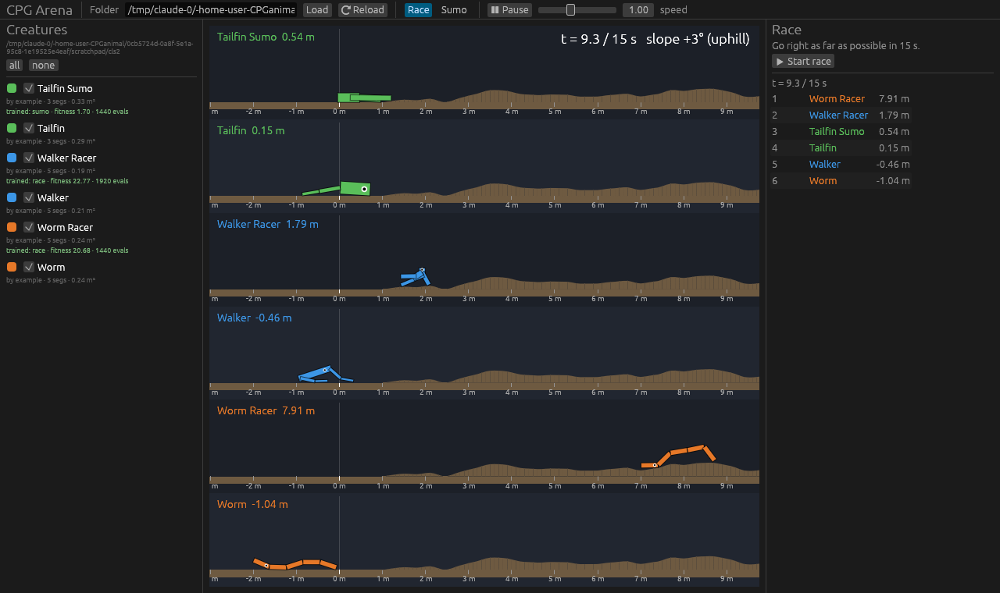

# CPG Arena: 用遗传算法进化人造生物

一个轻量级的教学游戏。每个学生设计一只由方块和关节组成的 2D 生物，关节由 **CPG（中枢模式发生器）** 驱动。学生用**默认遗传算法**或**自己写的遗传算法**进化它的参数，然后把生物文件放进同一个文件夹里比赛：**赛跑**比谁跑得远，**相扑**比谁把对手推下台。

| 赛跑（每只生物一条赛道） | 相扑（循环赛 + 决赛回放） |
|---|---|
|  |  |

源自本仓库的 MATLAB/Simulink 项目（Snake5 / chain_CPG），CPG 模型相同（Sproewitz et al. 2008），但修正了原 MATLAB 代码里的两个问题（见 [cpg.rs](src/cpg.rs) 顶部注释）。

---

## 快速开始

```bash
cd arena
cargo build --release                        # 需要 Rust ≥ 1.92
./target/release/arena-gui creatures         # 打开界面
python3 python/ga.py creatures/worm.toml --out creatures/me.toml   # 用默认 GA 进化一只
```

Linux 如果报 `libxkbcommon-x11.so could not be loaded`：`sudo apt install libxkbcommon-x11-0`。
只要命令行工具（比如在服务器上）：`cargo build --release --no-default-features`。

---

## 学生要做什么

```text
1. 设计身体             2. 进化参数                         3. 提交                 4. 比赛
worm.toml  ─────────▶  python/ga.py（默认 GA）  ────────▶  me.toml 拷进班级文件夹 ──▶ arena-gui 班级文件夹
（手写拓扑）           或 python/my_ga.py（自己写）                              （自动刷新）
```

### 1. 设计身体：生物文件

一个 `.toml` 文件就是一只生物。`segment` 0 是躯干，其余每一节通过一个电机关节挂在前面的某一节上，每个关节由一个 CPG 振荡器驱动。

```toml
name = "Worm"
author = "张三"
color = [230, 120, 40]      # 可选

[brain]
frequency = 1.0             # 振荡频率 (Hz)，所有关节共用
coupling = 4.0              # 相邻振荡器同步的强度

[[segment]]                 # 0: 躯干，没有关节
length = 0.4                # 米
width = 0.12

[[segment]]
parent = 0                  # 挂在哪一节上（必须是前面的节）
attach = 1.0                # 挂在父节的哪里：-1 后端，0 中间，1 前端
angle = 0.0                 # 静止时相对父节的角度（度）
length = 0.4
width = 0.12
amplitude = 30.0            # 关节摆动幅度（度）
offset = 0.0                # 摆动中心的偏移（度）
phase = 90.0                # 这个关节的相位（度），关节之间的相位差决定步态
```

每个关节的角度是 `angle + offset + amplitude·cos(ψ)`，ψ 是 CPG 的相位。示例见 [`creatures/`](creatures)：`worm`（蠕虫）、`walker`（两条腿）、`tailfin`（尾巴），以及它们进化后的版本。字段写错（比如 `amplitud`）会直接报错，不会被悄悄忽略。

### 2. 写遗传算法：接口

**身体拓扑是你设计的，GA 负责填数字。** 对 GA 来说，模拟器是一个黑盒优化问题：

| 概念 | 含义 |
|---|---|
| 基因组 genome | `dim` 个 **[0, 1]** 之间的浮点数（超出会被截断） |
| 适应度 fitness | 一个浮点数，**越大越好**；同一个基因组永远得到同样的结果（确定性） |
| 起点 start | 你手写的那只生物对应的基因组，可以放进初始种群 |

每个基因映射到什么物理量，可以用 `arena info` 查看。写 GA 并不需要知道这些，但调试时很有用。

#### 优化什么：三个层级

基因组控制的范围由 `level` 决定，层级越高，搜索空间越大：

| level | 基因控制 | worm 基因数 |
|---|---|---|
| `brain`（默认） | CPG：频率、耦合强度、每个关节的幅度 / 偏移 / 相位。身体就是模板 | 14 |
| `body` | 加上每一节的长、宽、挂接位置、静止角度。拓扑（几节、谁挂在谁上）仍是模板的 | 32 |
| `structure` | 加上**拓扑**：`max_segments` 个槽位，每个槽位有"是否存在"和"挂在哪个父节上"两个基因。模板只是起点 | 67 |

三个层级的基因组都是定长的 [0,1] 向量，所以同一个 GA 不用改就能在任何层级上跑。想用变长的、按结构操作的方式进化，见下面的"直接进化结构"。

#### Python（[`python/arena.py`](python/arena.py)，只用标准库）

```python
from arena import Problem

p = Problem("creatures/worm.toml", mode="race")   # mode: "race" 或 "sumo"
# 可选参数：level="brain" | "body" | "structure"；opponents="班级文件夹" 相扑对手；rules="arena.toml"

p.dim                        # 基因个数
p.start                      # 模板生物对应的基因组
p.genes                      # 每个基因的名字
fit = p.evaluate(population) # [[...], [...], ...] -> [f1, f2, ...]，整代并行评估
p.evaluations                # 已经评估了多少个基因组
p.describe(genome)           # 把基因翻译成物理量，调试用
p.save(best, "me.toml", name="我的冠军")   # 写成生物文件，返回适应度
```

**一代调用一次 `evaluate`**（传整个种群），不要一个个体调一次：整代在 Rust 里多核并行跑，一次 15 秒的赛跑只要约 10 ms。

起点文件：

| 文件 | 用途 |
|---|---|
| [`python/ga.py`](python/ga.py) | **默认 GA，直接能用**（锦标赛选择 + BLX-α 交叉 + 高斯变异 + 精英保留）。每个算子是一个独立函数，可以只替换其中一个 |
| [`python/my_ga.py`](python/my_ga.py) | 从零写 GA 的骨架：已经能跑，但 `select` / `crossover` / `mutate` 是占位的（进化不动） |
| [`python/random_search.py`](python/random_search.py) | 随机搜索基线：**你的 GA 在相同评估次数（BUDGET）下应该打败它** |

直接用默认 GA：

```bash
python3 python/ga.py creatures/worm.toml --out creatures/me.toml --name "我的虫"
python3 python/ga.py creatures/walker.toml --level body --budget 2000 --out ...       # 连身体尺寸一起进化
python3 python/ga.py creatures/worm.toml --level structure --budget 2000 --out ...    # 连拓扑一起进化
python3 python/ga.py creatures/tailfin.toml --mode sumo --opponents 班级文件夹 --out ...
# 其他参数：--population 50  --sigma 0.1（变异强度）  --seed 1  --rules 班级/arena.toml  --history h.csv（每代曲线）
```

只换一个算子，其余沿用默认：

```python
from arena import Problem
import ga

def my_mutation(genome):
    ...                                   # 你的变异

best, fitness = ga.run(Problem("creatures/worm.toml"), budget=1000, mutate=my_mutation)
# 同样可以替换 select=... 或 crossover=...，或者调 population / elites / crossover_rate
```

参考数据（worm，赛跑，1000 次评估）：占位骨架 3.6 m，随机搜索 8.1 m，默认 GA 10.9 m。

#### 其他语言：命令行协议

Python 包装只是调用下面这几个命令，任何语言都可以直接用：

```bash
arena info  creatures/worm.toml [--json]          # 基因个数、名字、范围、起点
arena batch creatures/worm.toml < pop.txt         # stdin 每行一个基因组（逗号或空格分隔）
                                                  # stdout 每行一个适应度，顺序相同，整批并行
arena eval  creatures/worm.toml --genes 0.3,0.5,...   # 单个基因组
arena save  creatures/worm.toml --genes ... --out me.toml --name "我的冠军"
arena fight creatures/tailfin.toml < pairs.txt    # 每行 "基因组A | 基因组B"，输出 A 对 B 的相扑得分
```

这些命令都接受同样的问题参数：`--mode race|sumo`、`--level brain|body|structure`、`--opponents <文件夹>`、`--rules <arena.toml>`，以及环境参数 `--trials`、`--env-seed`、`--friction-jitter`、`--aggregate`（见"泛化"）。基因组长度不对或含 NaN 时，命令以非零状态退出并在 stderr 说明原因。

#### 直接进化结构（进阶）

定长编码的 `structure` 层级很方便，但"加一条腿"在基因上可能要同时改好几个数。另一种做法是**直接对生物本身做变异**：个体就是一个生物（字典，字段和 `.toml` 文件一样），变异算子可以是"长出一节""剪掉一节叶子""把一条腿挪到别处"。这就是 Karl Sims 进化虚拟生物的思路。

```python
from arena import Judge, load_creature, save_creature

j = Judge(mode="race")                          # 可选 opponents=..., rules=...
worm = load_creature("creatures/worm.toml")     # dict: {"name":..., "brain": {...}, "segment": [{...}, ...]}
j.rules                                         # 所有限制：max_segments、各参数范围、面积预算……
j.evaluate([worm, other, ...])                  # 并行评估；违反规则的得 -inf
j.errors                                        # 以及原因，例如 "creature 3: body area 0.71 m² exceeds budget 0.60 m²"
save_creature(best, "me.toml")
```

[`python/evolve_structure.py`](python/evolve_structure.py) 是一个完整的例子：(μ+λ) 进化，带三个结构变异（`add_limb` / `remove_limb` / `reattach`）和一个参数变异（`nudge`），每个都可以改写。

命令行：`arena judge [--mode] [--opponents] [--rules]` 从 stdin 每行读一个 JSON 生物，每行输出一个适应度；`arena rules` 打印规则（JSON）；`arena convert in.toml -` / `arena convert - out.toml` 在 TOML 和 JSON 之间转换。

#### 参考数据

worm / walker 赛跑，2000 次评估，默认参数：

| 方法 | 从 worm 出发 | 从 walker 出发 |
|---|---|---|
| `ga.py --level brain` | 16.0 m | 11.9 m |
| `ga.py --level body` | 21.9 m | 28.3 m |
| `ga.py --level structure` | 17.7 m | 17.7 m |
| `evolve_structure.py`（直接结构变异） | 24.4 m | 34.7 m |

`structure` 层级两个起点结果完全一样：67 维时初始种群里 49 个随机个体淹没了唯一的模板个体，起点被"忘掉"了。

#### 协同进化：和同一种群里的个体打（相扑）

对着固定对手（石头、同学的旧文件）训练，只能学会打败那几个。**协同进化**让对手来自种群本身：你变强，对手也在变强，形成军备竞赛。

```python
p = Problem("creatures/tailfin.toml", mode="sumo")
scores = p.fight([(a, b), (c, d), ...])   # 每对 (基因组A, 基因组B) → A 对 B 的得分
# 得分是反对称的：B 的得分就是 -score，所以一场比赛同时给双方打分
j.fight([(creature_a, creature_b), ...])  # Judge 版本，直接用生物字典
```

[`python/coevolve.py`](python/coevolve.py) 是完整例子，处理了协同进化的两个经典问题：

- **循环克制**（A 胜 B、B 胜 C、C 胜 A，种群原地打转）：维护一个**名人堂**（过去每代的冠军），一半比赛对名人堂打，新个体必须同时能打败"老套路"。
- **没有绝对的进步信号**：种群内的适应度是相对的，大家一起变强时"最好适应度"可能不动。所以每 5 代让冠军对一个**固定基准**（`--benchmark 文件夹`）打一次，看真实进步。

```bash
python3 python/coevolve.py creatures/tailfin.toml --benchmark creatures --out creatures/me.toml
# 参数：--population 30 --generations 30 --bouts 4（每代每个体打几场）--hall 10（名人堂大小，0 = 关闭）
```

参考数据（tailfin，约 3600 场模拟，对 `creatures/` 里 5 个从没见过的对手）：只对石头训练的默认 GA 得 0.74，协同进化得 **1.43**。种群内的"最好适应度"一直在 1.0 附近徘徊，而对基准的成绩在上升：这正是相对适应度的特点。

#### 泛化：换一条赛道还能跑吗

老师可以在 `arena.toml` 里把比赛赛道设成起伏地形或斜坡（见"规则"），甚至不公开 `terrain_seed`。只在一条赛道上进化的生物可能**过拟合**这条赛道。解决办法和机器学习一样：在多个环境上训练，在没见过的环境上测试。

```python
# 训练：每个基因组在 4 条地形（种子 0..3）上评估，并随机改变摩擦 ±30%，取最差成绩
train = Problem("creatures/worm.toml", rules="班级/arena.toml",
                trials=4, env_seed=0, friction_jitter=0.3, aggregate="min")
# 测试：20 条没见过的地形（种子 1000..1019）
test = Problem("creatures/worm.toml", rules="班级/arena.toml", trials=20, env_seed=1000)
```

| 参数 | 含义 |
|---|---|
| `trials` | 每次评估用几个环境（默认 1 = 就是规则里那一个） |
| `env_seed` | 第一个环境的地形种子，第 k 个用 `env_seed + k`（默认用规则里的 `terrain_seed`） |
| `friction_jitter` | 每个环境的摩擦乘以 [1−j, 1+j] 里的随机数 |
| `aggregate` | `"mean"` 平均（通常表现好）或 `"min"` 最差情况（每种情况都不差） |

注意：`trials=4` 时每次评估要跑 4 场模拟，花费是 4 倍。

[`python/generalize.py`](python/generalize.py) 是一个现成的对比实验：`single`（一条地形）、`multi`（多条地形取平均）、`robust`（多条地形 + 摩擦扰动，取最差），各自进化，再在 20 条没见过的地形上测试。我们跑出来的结果**并不是"多环境一定好"**：

| 设置 | 方法 | 训练 | 测试平均 | 测试最差 | 打滑时最差 |
|---|---|---|---|---|---|
| worm，起伏 0.3 m，同样模拟次数 | single | 11.9 | **11.4** | **9.4** | **9.4** |
| | multi | 8.2 | 7.8 | 3.4 | 6.4 |
| | robust | 7.8 | 8.0 | 5.0 | 6.7 |
| walker 连身体，起伏 0.6 m，同样评估次数 | single | 6.4 | 5.4 | 1.4 | 0.4 |
| | multi | 8.7 | **8.4** | **5.8** | **6.1** |
| | robust | 2.9 | 5.1 | 2.8 | 2.2 |



*起伏 0.4 m + 3° 上坡的赛道。平地上第一名的 Walker Racer 在这里卡在 1.8 m：过拟合了平地。*

地形平缓、算力相同时，单环境训练更划算（多环境把算力分薄了）；地形崎岖、身体也在进化时，单环境训练的生物在没见过的地形上会崩（最差 1.4 m），多环境训练的稳得多。而直接优化最差情况（robust，`aggregate="min"`）在这两组里都不如优化平均：最差值作为训练信号更"硬"，梯度信息更少。**什么时候值得付出多环境的代价、该优化平均还是最差**，本身就是好的实验题目。

```bash
python3 python/generalize.py creatures/worm.toml --roughness 0.3                       # 同样模拟次数
python3 python/generalize.py creatures/walker.toml --level body --roughness 0.6 --same evaluations --budget 1000
```

`ga.py` 也支持这些参数：`--trials 4 --env-seed 0 --friction-jitter 0.3 --aggregate min`。

#### Rust

```rust
use cpg_arena::{creature::Level, game::Mode, problem::Problem};
let p = Problem::load("creatures/worm.toml".as_ref(), Mode::Race, Level::Brain, None, None)?;
let fit: Vec<f64> = p.evaluate_batch(&population)?;   // rayon 并行
p.save(&best, "me.toml".as_ref(), Some("我的冠军"))?;
```

### 3. 比赛

```bash
./target/release/arena-gui 班级文件夹              # 界面：勾选生物 → Start race / Tournament
./target/release/arena-gui 班级文件夹 --race       # 打开就开始赛跑（投屏用）
./target/release/arena-gui 班级文件夹 --tournament # 打开就开始相扑循环赛，结束后回放决赛
./target/release/arena race 班级文件夹             # 命令行排行榜
./target/release/arena tournament 班级文件夹       # 命令行相扑循环赛
./target/release/arena check 班级文件夹            # 检查所有文件是否合规
```

界面每秒检查一次文件夹，有新文件或改动会自动重新加载。不合规的文件会在左侧用红字标出原因。

---

## 规则与评分（教师）

所有生物遵守同一套规则：**身体越大越重，但每个关节的电机都一样**。默认值在 [`creature.rs`](src/creature.rs) 的 `Rules::default()`，在班级文件夹里放一个 `arena.toml` 可以覆盖任意一项（写错字段名会报错）：

```toml
# arena.toml（只写要改的项）
max_segments = 8          # 最多几节
max_area = 0.6            # 身体总面积预算 (m²)
motor_torque = 5.0        # 每个关节的最大力矩 (N·m)
frequency = [0.2, 3.0]    # 频率范围 (Hz)
race_time = 15.0          # 赛跑时长 (s)
sumo_time = 20.0          # 相扑时长 (s)
ring_width = 8.0          # 相扑台宽度 (m)
friction = 0.9
terrain_roughness = 0.0   # 赛道起伏高度 (m)，0 = 平地；起跑区 1 m 以内总是平的
terrain_seed = 0          # 哪一条随机地形；可以不告诉学生
slope = 0.0               # 赛道坡度（度），正数 = 上坡
```

学生在自己的文件夹里进化时，用 `--rules 班级/arena.toml`（Python：`rules=...`）保证和比赛规则一致。

| 模式 | 适应度 | 比赛胜负 |
|---|---|---|
| 赛跑 | `race_time` 秒内质心向右移动的距离（米） | 距离排名 |
| 相扑 | 对每个对手：胜 +1 / 平 0 / 负 −1，加上"场地控制"差值 ∈ [−1, 1]，取平均 | 掉下台即输；到时间则离中心更近者胜（差距太小算平）；循环赛每对打两场（左右各一次），胜 3 分、平 1 分 |

相扑适应度里的连续项是为了给 GA 一个平滑的信号，否则大多数个体都是 0 分，进化很难起步。

[`examples/reference_ga.rs`](examples/reference_ga.rs) 是同一个算法的 Rust 版本，用的是 Rust 接口，也可以当作 Rust 用法示例。

如果作业是"从零写 GA"，分发前可以删掉 `python/ga.py`，只留 `my_ga.py` 骨架和 `random_search.py` 基线。

```bash
cargo run --release --example reference_ga -- creatures/worm.toml race 1000 out.toml
```

---

## 代码结构

```text
arena/
├── src/
│   ├── cpg.rs        # CPG 振荡器网络（RK4）
│   ├── creature.rs   # 生物文件格式、规则、合规检查、三个层级的基因编解码
│   ├── sim.rs        # 2D 物理（rapier2d）：搭身体、驱动关节、赛道和相扑台
│   ├── problem.rs    # 学生 GA 面对的黑盒接口：dim / start / evaluate_batch / save
│   ├── game.rs       # 适应度、文件夹加载、循环赛
│   └── bin/
│       ├── arena.rs      # 命令行（info / eval / batch / fight / save / judge / rules / convert / check / race / tournament）
│       └── arena-gui.rs  # 界面（eframe/egui）
├── python/           # arena.py 接口、ga.py 默认 GA、my_ga.py 骨架、random_search.py 基线、
│                     # evolve_structure.py 结构进化、coevolve.py 协同进化、generalize.py 泛化实验
├── examples/         # reference_ga.rs 参考答案（教师）
└── creatures/        # 示例生物
```

## 课堂可以讨论的问题

- 同样 1000 次评估，你的 GA 比随机搜索、比默认 GA 好多少？换几个随机种子，结论还成立吗？
- 把默认 GA 的变异换成"不变异"、交叉换成"直接复制"：各自损失多少？哪个算子最重要？
- 种群大小、变异强度怎么影响收敛速度和最终结果？探索和利用。
- `brain` → `body` → `structure`：搜索空间越来越大，同样的评估次数下结果为什么不是越来越好？
- 同样是进化结构，定长槽位编码（`--level structure`）和直接结构变异（`evolve_structure.py`）差很多：**表示方式**怎么影响进化？
- `structure` 层级为什么"忘掉"了模板？怎样的初始种群能保住它（比如用模板的变异体填满初始种群）？
- 为赛跑进化的生物，相扑为什么常常打不过（反之亦然）？专才和通才。
- 相扑里经常出现"石头剪刀布"式的循环克制，没有绝对最强。协同进化时把名人堂关掉（`--hall 0`），会发生什么？
- 协同进化时，种群内的"最好适应度"为什么不能说明进步？还有什么办法衡量？
- 在平地上进化的冠军，放到起伏赛道上还是冠军吗？（界面里放一个 `terrain_roughness = 0.4` 的 `arena.toml` 就能看到）
- 多环境训练什么时候值得？和机器学习里的训练集 / 测试集、数据增强有什么相同和不同？
- GA 找到的"作弊"步态（比如翻个身滑行）：是 bug 还是创新？规则应该怎么改？
