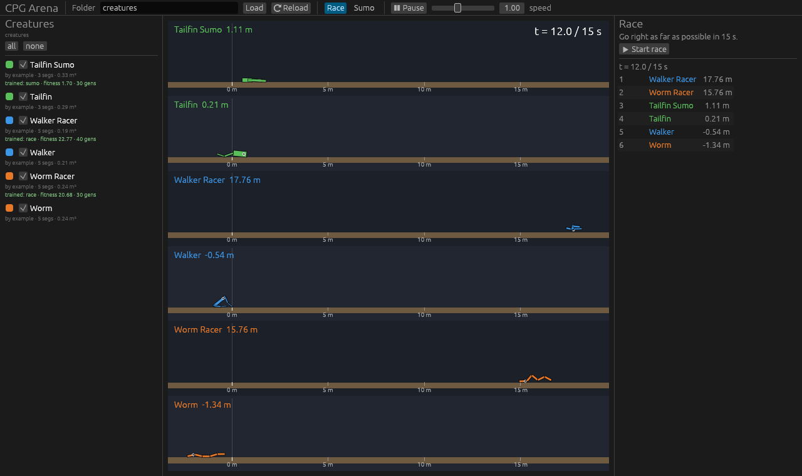
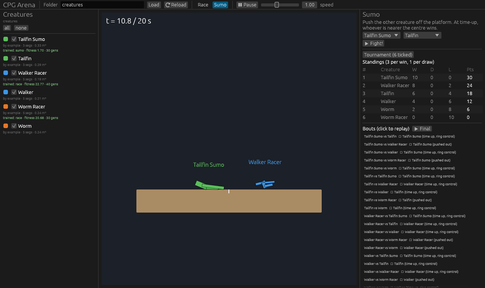
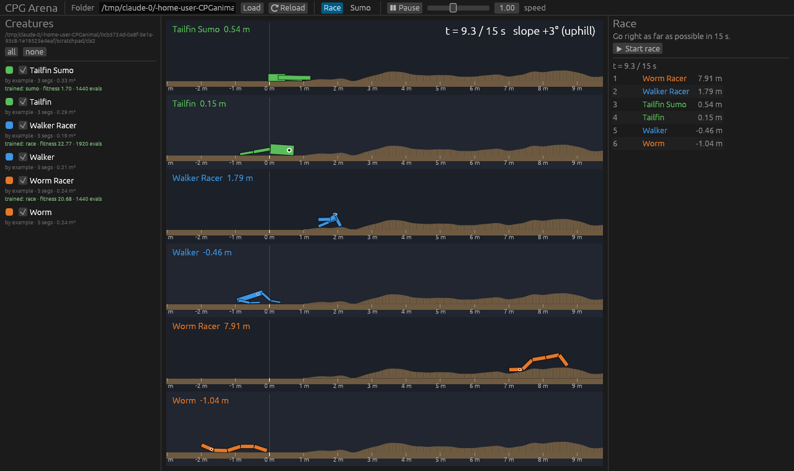

# CPG Arena: evolving artificial creatures with genetic algorithms

A lightweight teaching game. Each student designs a 2D creature made of blocks and joints, with the joints driven by a **CPG (central pattern generator)**. Students evolve its parameters with the **default genetic algorithm** or **a genetic algorithm they write themselves**, then put their creature files in a shared folder to compete: the **race** rewards whoever gets furthest, **sumo** whoever pushes the opponent off the platform.

| Race (one lane per creature) | Sumo (round robin + final replay) |
|---|---|
|  |  |

Derived from the MATLAB/Simulink project in this repository (Snake5 / chain_CPG). The CPG model is the same (Sproewitz et al. 2008), with two problems in the original MATLAB code fixed (see the comment at the top of [cpg.rs](src/cpg.rs)).

---

## Quick start

```bash
cd arena
cargo build --release                        # needs Rust >= 1.92
./target/release/arena-gui creatures         # open the GUI
python3 python/ga.py creatures/worm.toml --out creatures/me.toml   # evolve one with the default GA
```

Linux: if you get `libxkbcommon-x11.so could not be loaded`, run `sudo apt install libxkbcommon-x11-0`.

Windows: if linking fails with `ld.exe: cannot find ...: No such file or directory`, the path contains non-ASCII characters (e.g. `OneDrive - Högskolan Väst`), which the linker of the GNU toolchain (`x86_64-pc-windows-gnu`) cannot handle. Put the build output in an ASCII-only folder outside OneDrive: run this once in PowerShell, open a new terminal, then `cargo build --release` again.

```powershell
[Environment]::SetEnvironmentVariable("CARGO_TARGET_DIR", "$env:USERPROFILE\cargo-target", "User")   # use C:\cargo-target if your user name has non-ASCII characters
```

The executables are then in `release\` inside that folder (not in `./target/release/`); `python/arena.py` finds them automatically.

Command-line tools only (e.g. on a server): `cargo build --release --no-default-features`.

---

## What students do

```text
1. Design a body          2. Evolve parameters                 3. Submit                   4. Compete
worm.toml  ─────────▶  python/ga.py (default GA)  ───────▶  copy me.toml to class/  ──▶  arena-gui class/
(hand-written topology)   or python/my_ga.py (your own)                                   (auto-reload)
```

### 1. Design a body: the creature file

**In the GUI**: the **Design** tab of `arena-gui` builds a creature without writing any file by hand.

- Name it, then drag blocks (Leg, Short leg, Block, Plate) from the palette onto the creature. A block attaches at the nearest point of the nearest segment (snapping to its back end, middle or front end) and points towards the cursor; a see-through preview shows where it will go.
- Click a block to change its size, where it attaches, its angle and its motor (amplitude, offset, phase) with sliders; drag a block to turn it around its joint; Delete removes it with everything hanging on it. "Start from" loads a copy of any creature in the folder.
- The panel checks the rules as you go (the body area budget, the number of segments). **Try it** runs the design in a race, or in a sumo bout against the Rock or any creature in the folder.
- **Save** writes it to the `creatures` folder (named after the creature, never over an existing file); **Train it** saves it and opens it in the Train tab.

The Design tab writes the same kind of file you can also write by hand. One `.toml` file is one creature. `segment` 0 is the torso; every other segment hangs off an earlier segment through a motorised joint, and each joint is driven by one CPG oscillator.

```toml
name = "Worm"
author = "Alex"
color = [230, 120, 40]      # optional

[brain]
frequency = 1.0             # oscillation frequency (Hz), shared by all joints
coupling = 4.0              # how strongly neighbouring oscillators synchronise

[[segment]]                 # 0: torso, no joint
length = 0.4                # metres
width = 0.12

[[segment]]
parent = 0                  # which segment it hangs off (must come earlier)
attach = 1.0                # where on the parent: -1 back end, 0 middle, 1 front end
angle = 0.0                 # rest angle relative to the parent (degrees)
length = 0.4
width = 0.12
amplitude = 30.0            # joint swing amplitude (degrees)
offset = 0.0                # offset of the swing centre (degrees)
phase = 90.0                # phase of this joint (degrees); phase differences between joints set the gait
```

Each joint's angle is `angle + offset + amplitude·cos(ψ)`, where ψ is the CPG phase. See [`creatures/`](creatures) for examples: `worm`, `walker` (two legs), `tailfin` (a tail), and their evolved versions. A misspelled field (e.g. `amplitud`) is an error, not silently ignored.

### 2. Write a genetic algorithm: the interface

**You design the body topology; the GA fills in the numbers.** To the GA, the simulator is a black-box optimisation problem:

| Concept | Meaning |
|---|---|
| genome | `dim` floats in **[0, 1]** (values outside are clamped) |
| fitness | one float, **higher is better**; the same genome always gets the same result (deterministic) |
| start | the genome of your hand-written creature; you can put it in the initial population |

`arena info` shows which physical quantity each gene maps to. You don't need this to write a GA, but it helps when debugging.

#### What to optimise: three levels

`level` decides what the genome controls; the higher the level, the larger the search space:

| level | Genes control | Genes for worm |
|---|---|---|
| `brain` (default) | The CPG: frequency, coupling, and each joint's amplitude / offset / phase. The body is the template's | 14 |
| `body` | Plus each segment's length, width, attachment point and rest angle. The topology (how many segments, what hangs off what) is still the template's | 32 |
| `structure` | Plus the **topology**: `max_segments` slots, each with an "exists" gene and a "which parent" gene. The template is just the starting point | 67 |

**The GA itself does not change between levels.** At every level the genome is a fixed-length list of numbers in [0, 1], and the GA only ever reads and writes such lists. What changes is how the arena *decodes* the list: at `brain` the DNA becomes movement (the CPG); at `body` and `structure` the same kind of list also becomes the shape of the body and its structure. Going from evolving a gait to evolving a body is a change in the mapping from DNA to creature, not in the algorithm. The DNA tab of the GUI shows the three layouts side by side.

The exception is "Evolving structure directly" below: there the individuals are creatures, not lists, and it is the algorithm (its mutation operators) that changes.

#### Python ([`python/arena.py`](python/arena.py), standard library only)

```python
from arena import Problem

p = Problem("creatures/worm.toml", mode="race")   # mode: "race" or "sumo"
# optional: level="brain" | "body" | "structure"; opponents="class" (sumo opponents); rules="arena.toml"

p.dim                        # number of genes
p.start                      # genome of the template creature
p.genes                      # name of each gene
fit = p.evaluate(population) # [[...], [...], ...] -> [f1, f2, ...], whole generation in parallel
p.evaluations                # how many genomes have been evaluated so far
p.describe(genome)           # translate genes into physical quantities, for debugging
p.save(best, "me.toml", name="My Champion")   # write a creature file, returns its fitness
```

**Call `evaluate` once per generation** (with the whole population), not once per individual: the whole generation runs in parallel on all cores in Rust, and a 15-second race takes about 10 ms.

Starting points:

| File | Purpose |
|---|---|
| [`python/ga.py`](python/ga.py) | **The default GA, ready to use** (tournament selection + BLX-α crossover + Gaussian mutation + elitism). Each operator is a separate function, so you can replace just one |
| [`python/my_ga.py`](python/my_ga.py) | Skeleton for writing your own GA: the same structure, options and output as `ga.py` (including `run()`), but `select` / `crossover` / `mutate` are placeholders, so nothing evolves until you write them |
| [`python/random_search.py`](python/random_search.py) | Random search baseline: **your GA should beat it with the same number of evaluations (BUDGET)** |

Using the default GA directly:

```bash
python3 python/ga.py creatures/worm.toml --out creatures/me.toml --name "My Worm"
python3 python/ga.py creatures/walker.toml --level body --budget 2000 --out ...       # evolve body sizes too
python3 python/ga.py creatures/worm.toml --level structure --budget 2000 --out ...    # evolve topology too
python3 python/ga.py creatures/tailfin.toml --mode sumo --opponents class --out ...
# more options: --population 50  --sigma 0.1 (mutation strength)  --seed 1  --rules class/arena.toml  --history h.csv (curve per generation)
```

Replace just one operator and keep the rest:

```python
from arena import Problem
import ga

def my_mutation(genome):
    ...                                   # your mutation

best, fitness = ga.run(Problem("creatures/worm.toml"), budget=1000, mutate=my_mutation)
# likewise select=... or crossover=..., or tune population / elites / crossover_rate
```

Reference results (worm, race, a budget of 1000 evaluations, default settings): placeholder skeleton `my_ga.py` 3.5 m, random search 7.7 m, default GA 12.6 m. No algorithm uses more than its budget (the GAs stop at 962: a 21st generation would not fit).

#### Training in the GUI: the Train tab

If you'd rather not use a terminal, the **Train** tab at the top of `arena-gui` runs these scripts directly:

- **Algorithm**: the default GA (`ga.py`), your own GA (`my_ga.py`), structure evolution, co-evolution, random search, or **Custom script…** to pick any `.py` file (e.g. a copy of `my_ga.py` you have made your own).
- **Settings**: template creature (from the current folder), mode, level, number of evaluations, population size, random seed; for sumo, the Rock or any creatures you tick in the current folder (the fitness is the average over them; for co-evolution these are the benchmark). If the folder has an `arena.toml`, it is used as the rules. `Extra args` passes any other options to the script, e.g. `--sigma 0.2`.
- **Result**: every champion is saved as a **new** creature in the `creatures` folder, with the algorithm and time in its name, e.g. `Worm (ga 14:02:31)` in `worm-ga-20260929-140231.toml`. Nothing is overwritten, so all your runs appear in the list on the left and can race each other straight away. (When another folder is open, a button opens the `creatures` folder.)
- **Watch the population while training** (checkbox): replays each generation with every individual drawn faintly and the best one highlighted. You see the population go from random flailing to a gait. Drag the generation slider to go back to any generation, or tick "follow the latest"; the speed slider and Pause at the top control the playback. In sumo, every individual fights the first opponent. This works with any script, your own GA included: `python/arena.py` records every population passed to `evaluate`, and in co-evolution every population that fights a round of `fight` duels (each individual's fitness is then its mean score in those duels; in the replay they all fight the Rock).
- **Comparison**: every run is drawn on the same chart, best fitness as a solid line and mean fitness dashed, against the number of evaluations; a vertical line marks the generation being replayed. With the same number of evaluations you can see at a glance whether your GA, the default GA or random search does best.
- **DNA** tab: what the GA actually works with, for the generation picked with the slider.
  - *Same GA, different decoding*: the genome layout at the `brain`, `body` and `structure` levels, each gene coloured by what it becomes (movement, body shape, structure), with this run's level marked.
  - *Raw data*: the literal lists of numbers for the template (where evolution starts) and for the best of the generation, with a copy button to paste them into Python. For direct structure evolution the individual is a creature dict instead.
  - One row per gene: every individual of the generation as a dot (the spread is the population's diversity, which shrinks as it converges), the best as a diamond, the template as a line, and a heatmap of the best genome of every generation, so you can see which genes evolve and when. Hover for exact values.
- **Output** tab: the script's output; Python errors are shown in red, and the tab opens by itself when a run fails.

A custom script must accept the same arguments as `my_ga.py` (template path, `--out`, `--name`, `--mode`, `--level`, `--budget`, `--population`, `--seed`, `--opponents`, `--rules`) and print one progress line per generation containing `evaluations N` and `best X` (optionally `mean Y`); the GUI then draws its curve. The simplest way is to copy `my_ga.py` and change only the three operators.

#### Other languages: the command-line protocol

The Python wrapper only calls these commands, so any language can use them directly:

```bash
arena info  creatures/worm.toml [--json]          # number of genes, names, ranges, start
arena batch creatures/worm.toml < pop.txt         # stdin: one genome per line (comma or space separated)
                                                  # stdout: one fitness per line, same order, whole batch in parallel
arena eval  creatures/worm.toml --genes 0.3,0.5,...   # a single genome
arena save  creatures/worm.toml --genes ... --out me.toml --name "My Champion"
arena fight creatures/tailfin.toml < pairs.txt    # one "genomeA | genomeB" per line; prints A's sumo score against B
```

All these commands take the same problem options: `--mode race|sumo`, `--level brain|body|structure`, `--opponents <folder>`, `--rules <arena.toml>`, plus the environment options `--trials`, `--env-seed`, `--friction-jitter`, `--aggregate` (see "Generalisation"). If a genome has the wrong length or contains NaN, the command exits with a non-zero status and explains why on stderr.

#### Evolving structure directly (advanced)

The fixed-length `structure` level is convenient, but "add a leg" may mean changing several genes at once. The alternative is to **mutate the creature itself**: an individual is a creature (a dict with the same fields as the `.toml` file), and the mutation operators can be "grow a segment", "prune a leaf segment", "move a leg somewhere else". This is Karl Sims' approach to evolving virtual creatures. Unlike the levels above, here the algorithm changes (new mutation operators), not the decoding.

```python
from arena import Judge, load_creature, save_creature

j = Judge(mode="race")                          # optional opponents=..., rules=...
worm = load_creature("creatures/worm.toml")     # dict: {"name":..., "brain": {...}, "segment": [{...}, ...]}
j.rules                                         # all limits: max_segments, parameter ranges, area budget...
j.evaluate([worm, other, ...])                  # evaluated in parallel; rule breakers get -inf
j.errors                                        # and the reasons, e.g. "creature 3: body area 0.71 m² exceeds budget 0.60 m²"
save_creature(best, "me.toml")
```

[`python/evolve_structure.py`](python/evolve_structure.py) is a complete example: (μ+λ) evolution with three structural mutations (`add_limb` / `remove_limb` / `reattach`) and one parameter mutation (`nudge`), each of which you can rewrite.

Command line: `arena judge [--mode] [--opponents] [--rules]` reads one JSON creature per line from stdin and prints one fitness per line; `arena rules` prints the rules (JSON); `arena convert in.toml -` / `arena convert - out.toml` convert between TOML and JSON.

#### Reference results

worm / walker race, 2000 evaluations, default settings:

| Method | From worm | From walker |
|---|---|---|
| `ga.py --level brain` | 16.0 m | 11.9 m |
| `ga.py --level body` | 21.9 m | 28.3 m |
| `ga.py --level structure` | 17.7 m | 17.7 m |
| `evolve_structure.py` (direct structural mutation) | 24.4 m | 34.7 m |

At the `structure` level both starting points give exactly the same result: with 67 dimensions, the 49 random individuals in the initial population swamp the single template individual, and the starting point is "forgotten".

#### Co-evolution: fighting your own population (sumo)

Training against fixed opponents (the Rock, classmates' old files) only teaches a creature to beat those few. **Co-evolution** takes the opponents from the population itself: as you get stronger, so do your opponents, and an arms race follows.

```python
p = Problem("creatures/tailfin.toml", mode="sumo")
scores = p.fight([(a, b), (c, d), ...])   # each pair (genome A, genome B) -> A's score against B
# scores are antisymmetric: B's score is -score, so one bout rates both sides
j.fight([(creature_a, creature_b), ...])  # Judge version, with creature dicts
```

[`python/coevolve.py`](python/coevolve.py) is a complete example that handles the two classic problems of co-evolution:

- **Cycling** (A beats B, B beats C, C beats A, and the population goes round in circles): it keeps a **hall of fame** (the champions of past generations), and half the bouts are against the hall of fame, so a new individual must also beat the "old tricks".
- **No absolute progress signal**: fitness within the population is relative, so when everyone improves together the "best fitness" may not move. Every 5 generations the champion therefore fights a **fixed benchmark** (`--benchmark folder`) to measure real progress.

```bash
python3 python/coevolve.py creatures/tailfin.toml --benchmark creatures --out creatures/me.toml
# options: --population 30 --generations 30 --bouts 4 (bouts per individual per generation) --hall 10 (hall of fame size, 0 = off)
```

Reference results (tailfin, about 3600 simulated bouts, against 5 unseen opponents in `creatures/`): the default GA trained only against the Rock scores 0.74, co-evolution **1.43**. The "best fitness" within the population hovers around 1.0 throughout while the score against the benchmark rises: exactly what relative fitness looks like.

#### Generalisation: can it still run on a different track?

The teacher can make the competition track hilly or sloped in `arena.toml` (see "Rules"), and even keep `terrain_seed` secret. A creature evolved on a single track may **overfit** that track. The remedy is the same as in machine learning: train on several environments, test on unseen ones.

```python
# training: each genome is evaluated on 4 terrains (seeds 0..3) with friction randomly changed by ±30%, taking the worst result
train = Problem("creatures/worm.toml", rules="class/arena.toml",
                trials=4, env_seed=0, friction_jitter=0.3, aggregate="min")
# testing: 20 unseen terrains (seeds 1000..1019)
test = Problem("creatures/worm.toml", rules="class/arena.toml", trials=20, env_seed=1000)
```

| Option | Meaning |
|---|---|
| `trials` | how many environments per evaluation (default 1 = just the one in the rules) |
| `env_seed` | terrain seed of the first environment; the k-th uses `env_seed + k` (default: `terrain_seed` from the rules) |
| `friction_jitter` | each environment's friction is multiplied by a random number in [1−j, 1+j] |
| `aggregate` | `"mean"` average (usually performs well) or `"min"` worst case (never bad anywhere) |

Note: with `trials=4` each evaluation runs 4 simulations, so it costs 4 times as much.

[`python/generalize.py`](python/generalize.py) is a ready-made comparison: `single` (one terrain), `multi` (several terrains, averaged) and `robust` (several terrains + friction jitter, worst case) each evolve, and are then tested on 20 unseen terrains. Our results show that **more environments is not automatically better**:

| Setting | Method | Train | Test mean | Test worst | Worst when slippery |
|---|---|---|---|---|---|
| worm, hills 0.3 m, same number of simulations | single | 11.9 | **11.4** | **9.4** | **9.4** |
| | multi | 8.2 | 7.8 | 3.4 | 6.4 |
| | robust | 7.8 | 8.0 | 5.0 | 6.7 |
| walker with body, hills 0.6 m, same number of evaluations | single | 6.4 | 5.4 | 1.4 | 0.4 |
| | multi | 8.7 | **8.4** | **5.8** | **6.1** |
| | robust | 2.9 | 5.1 | 2.8 | 2.2 |



*A track with 0.4 m hills and a 3° uphill slope. Walker Racer, first on flat ground, gets stuck at 1.8 m here: it overfitted the flat track.*

On gentle terrain with the same compute, single-environment training is the better deal (multiple environments spread the compute thin). On rough terrain with the body also evolving, creatures trained on one environment collapse on unseen terrain (worst case 1.4 m), while those trained on several are much more stable. Optimising the worst case directly (robust, `aggregate="min"`) loses to optimising the mean in both settings: the worst value is a "harder" training signal that carries less gradient information. **When multiple environments are worth their cost, and whether to optimise the mean or the worst case,** are good experiments in themselves.

```bash
python3 python/generalize.py creatures/worm.toml --roughness 0.3                       # same number of simulations
python3 python/generalize.py creatures/walker.toml --level body --roughness 0.6 --same evaluations --budget 1000
```

`ga.py` supports these options too: `--trials 4 --env-seed 0 --friction-jitter 0.3 --aggregate min`.

#### Rust

```rust
use cpg_arena::{creature::Level, game::Mode, problem::Problem};
let p = Problem::load("creatures/worm.toml".as_ref(), Mode::Race, Level::Brain, None, None)?;
let fit: Vec<f64> = p.evaluate_batch(&population)?;   // parallel with rayon
p.save(&best, "me.toml".as_ref(), Some("My Champion"))?;
```

### 3. Compete

```bash
./target/release/arena-gui class              # GUI: tick creatures -> Start race / Tournament
./target/release/arena-gui class --race       # start the race on launch (for the projector)
./target/release/arena-gui class --tournament # start the sumo round robin on launch, then replay the final
./target/release/arena race class             # leaderboard on the command line
./target/release/arena tournament class       # sumo round robin on the command line
./target/release/arena check class            # check that every file follows the rules
```

Without a folder argument the GUI opens `creatures` (creatures made in the Design and Train tabs are saved there too); pick another folder with **Browse…** at the top. The GUI checks the folder every second and reloads when files are added or changed. Files that break the rules are listed on the left in red, with the reason.

---

## Rules and scoring (teachers)

Every creature follows the same rules: **a bigger body is heavier, but every joint has the same motor**. The defaults are in `Rules::default()` in [`creature.rs`](src/creature.rs); an `arena.toml` in the class folder can override any of them (a misspelled field name is an error):

```toml
# arena.toml (only the settings you want to change)
max_segments = 8          # maximum number of segments
max_area = 0.6            # total body area budget (m²)
motor_torque = 5.0        # maximum torque per joint (N·m)
frequency = [0.2, 3.0]    # frequency range (Hz)
race_time = 15.0          # race duration (s)
sumo_time = 20.0          # sumo duration (s)
ring_width = 8.0          # width of the sumo platform (m)
friction = 0.9
terrain_roughness = 0.0   # hill height of the track (m), 0 = flat; the first 1 m of the start is always flat
terrain_seed = 0          # which random terrain; you don't have to tell the students
slope = 0.0               # track slope (degrees), positive = uphill
```

When students evolve in their own folders, they use `--rules class/arena.toml` (Python: `rules=...`) so that their training matches the competition rules.

| Mode | Fitness | Competition result |
|---|---|---|
| Race | distance (m) the centre of mass moves to the right in `race_time` seconds | ranked by distance |
| Sumo | against each opponent: win +1 / draw 0 / loss −1, plus the "ring control" difference ∈ [−1, 1], averaged | falling off the platform loses; at time-up whoever is nearer the centre wins (too close to call is a draw); in the round robin each pair fights twice (once from each side), 3 points for a win, 1 for a draw |

The continuous term in the sumo fitness gives the GA a smooth signal; otherwise most individuals would score 0 and evolution would struggle to get started.

[`examples/reference_ga.rs`](examples/reference_ga.rs) is the same algorithm in Rust, using the Rust interface; it doubles as a Rust usage example.

If the assignment is "write a GA from scratch", you can delete `python/ga.py` before handing out the code and keep only the `my_ga.py` skeleton and the `random_search.py` baseline.

```bash
cargo run --release --example reference_ga -- creatures/worm.toml race 1000 out.toml
```

### Handing out the program (Windows)

Students do not need Rust. On Windows, run

```powershell
powershell -ExecutionPolicy Bypass -File package.ps1
```

in `arena/`. It builds the programs and puts together `dist/CPG-Arena/` and `dist/CPG-Arena.zip` (about 11 MB): `arena-gui.exe`, `arena.exe`, `python/`, the example creatures (only the files tracked by git), a short guide for students ([`STUDENTS.md`](STUDENTS.md), as `README.md`) and this guide (as `GUIDE.md`). The programs need only Windows' own libraries; students need Python 3.8+ for training. Unzipped anywhere, `arena-gui.exe` finds `python/` and `creatures/` next to itself, and saves new creatures there. For a "write a GA from scratch" assignment, delete `python/ga.py` from the folder before zipping it again (co-evolution and the Train tab's default GA use it).

---

## Code structure

```text
arena/
├── src/
│   ├── cpg.rs        # CPG oscillator network (RK4)
│   ├── creature.rs   # creature file format, rules, validation, gene encoding for the three levels
│   ├── sim.rs        # 2D physics (rapier2d): building bodies, driving joints, race track and sumo platform
│   ├── problem.rs    # the black-box interface the students' GA sees: dim / start / evaluate_batch / save
│   ├── game.rs       # fitness, folder loading, round robin
│   └── bin/
│       ├── arena.rs      # command line (info / eval / batch / fight / save / judge / rules / convert / check / race / tournament)
│       └── arena-gui/    # GUI (eframe/egui)
│           ├── main.rs   # creature list, race, sumo
│           ├── design.rs # Design tab: build a creature from blocks, try it, save it
│           └── train.rs  # Train tab: runs the Python training scripts, plots fitness curves, replays populations
├── python/           # arena.py interface, ga.py default GA, my_ga.py skeleton, random_search.py baseline,
│                     # evolve_structure.py structure evolution, coevolve.py co-evolution, generalize.py generalisation experiment
├── examples/         # reference_ga.rs reference solution (teachers)
└── creatures/        # example creatures
```

## Questions for class discussion

- With the same 1000 evaluations, how much better is your GA than random search, and than the default GA? Does the conclusion hold for other random seeds?
- Replace the default GA's mutation with "no mutation", and its crossover with "just copy": how much does each cost? Which operator matters most?
- How do population size and mutation strength affect convergence speed and the final result? Exploration versus exploitation.
- `brain` → `body` → `structure`: the search space keeps growing, so why don't the results keep improving with the same number of evaluations?
- Both evolve structure, yet the fixed-slot encoding (`--level structure`) and direct structural mutation (`evolve_structure.py`) differ a lot: how does the **representation** affect evolution?
- The GA code is identical at the `brain`, `body` and `structure` levels; only the decoding of the DNA changes. So why is evolving a body harder than evolving a gait? Watch the DNA tab: which genes settle first?
- Why does the `structure` level "forget" the template? What kind of initial population would keep it (e.g. filling it with mutants of the template)?
- Why do creatures evolved for racing often lose at sumo (and vice versa)? Specialists and generalists.
- Sumo often shows rock-paper-scissors cycles with no single strongest creature. What happens in co-evolution if you turn off the hall of fame (`--hall 0`)?
- Why doesn't the "best fitness" within the population show progress in co-evolution? How else could you measure it?
- Is the champion evolved on flat ground still the champion on a hilly track? (Put an `arena.toml` with `terrain_roughness = 0.4` in the folder and watch in the GUI.)
- When is training on multiple environments worth it? What is similar to, and different from, training / test sets and data augmentation in machine learning?
- "Cheating" gaits the GA finds (e.g. flipping over and sliding): bug or innovation? How should the rules change?
